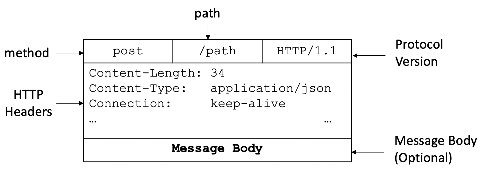
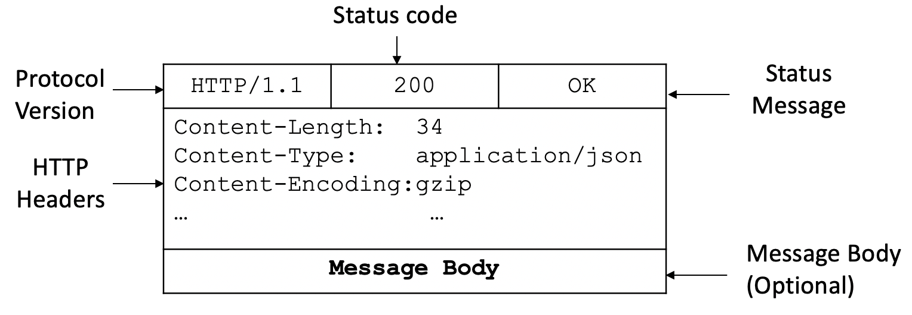

# Network Commnication (TCP/IP Model)

## Multithreading vs Distributed Systems

Multithreading: all our threads running on the context of the same application, they all had a shard memory space or they could pass data to each other.

Distributed Systems: using **network** to communicate with each other. 


## TCP/IP Network Model

Application --- HTTP, FTP, SMTP --- Application</br>
Transport   --- TCP, UDP ---   Transport</br>
Internet    --- **IP**, ICMP --- Internet</br>
Data Link   --- **Ethernet**, 802.11, ARP, RAPR --- Data Link

In this model, each layer is getting services from their underneath layer, and communicating with the same layer on the other machine or station using relevant protocols.

### Layer 1 - Data Link

- Physical delievery of data over a single link
- In charge of 
    - Encapsulation of the data
    - Flow control
    - Error detection
    - Error correction
    - etc...

The most important protocol is the Ethernet.

### Layer 2 - Internet

In charge of delievering the data potentially across multiple networks and make the package to the destination computer

Do not care about which process is intended for, just care about delievery


### Layer 3 - Transport 

Takes care of delievering the message end to end from the process on one machine to another process on the other machine. 

There are 2 primary protocols

#### User Datagram Protocol (UDP)**

- Connectionless
- Best effort - Unreliable
- Message can be
    - Lost
    - Duplicated
    - Reordered 
- Based on a unit call *Datagram* which is limited in size


**UDP in Distributed System**

UDP is preferred when the speed and simplicity is more important than reliability 

e.g. 
1. Senging dubug information to a distributed logging service
2. Real time data stream service such as video or audio
3. Online gaming
4. Boradcasting


#### Transmission Control Protocol (TCP)

- Reliable - Guarantees data delievery as sent, without any losses
- Connection between 2 points
    - Needs to be created before data is sent
    - Shut down in the end
- Works as a streaming interface
- More popular protocol in distributed systems because of the reliability


### Layer 4 - Application

Protocol | Purpose
---|---
FTP (File Transfer Protocol) | Transfering files through the web
SMTP (Simple Mail Transfer Protocol) | Sending and receiving emails
DNS (Domain Name System) | Translating host names into IP addresses
HTTP (Hypertext Transfer Protocol) | Transmitting Hypermedia documents, video, sound, images


### Client Server Request Example

Application: create a message using HTTP:
```
GET HTTP/1.1
Host: 24.28.18.17:8080
Content-Length: 20
...
```

Transport: A TCP header will add to the message
```
Dest Port: 8080
Src Port: 12345
```


Internet: Add another header containing the server IP address and client IP address
```
Dest IP: 24.28.18.17
Src IP: 23.241.168.123
```

Data Link: The ethernet protocol adds the MAC address of the router and the client

```
Dest MAC: 18:F3:93:9A:1C:76
Src MAC: A5:DE:43:AC:11:63
```

All those layer together are forming a frame. The entire framework in now send through the network in the form of individual bits, and arrives at the router. 

When the router receives the message, it removes the ethernet head, look at the destination IP address, and using a router table to figure its out the network that this message needs to be send next. So it would arrive the destination server. 

Then the router adds an new ethernet header, with the server MAC address ad destination, and the router MAC address as the source.

``` 
Dest MAC: 74:BC:15:AF:FF:34
Src MAC: 18:F3:93:9A:1C:76
```

After that, it sends the frame over the link to the server.

When the frame finally arrives at the server, the layer would be piled one after another.

First, the ethernet header is removed, the server validates that the package actually belongs to this server. Next, the IP header is removed, saving the source IP address in memory so that the server can use it to respond to the client. Later on the transport layer, the destination port is inspected, to see which application and which socket is listening on that port. After the application instance is identified by the OS, the TCP header is removed, and the message is headed to the application.


# HTTP for Communication in Distributed Systems

## HTTP Request Structure



### HTTP Method

#### HTTP - Request Get Method

- Safe - Only retrieval action with no side effects
    - Like a gette methods in java
- Idempotent - Performing the underlying operation N times is equivalent to performing the operation only once


#### HTTP - Request Post Method

- Contains a message body (payload)
- The operation may have side effects and we expect the server to perform a complex operation and give us a result
- Because the *Post* request can carry a message body, it is very useful in communication between nodes.

### HTTP Relative Path

http:// 123.45.34:8080/**status**

http:// 123.45.34:8080/**users?userId=123&month=03**


### HTTP Protocol Version

#### HTTP/1.1

Disadvantage

- Creating a new connection for every request is expensive
- The number of outging connections a client can maintain is limted by 
    - Number of ports
    - The Operating System

Advantage

- If one of the TCP connection breaks, the other connection stay unaffected

#### HTTP/2

Instead of creating a new connection for each request, the protocol can interlive multiple requests and responses on the sae connection

### HTTP Header

- Many standard headers that are used for many purposes
- Some headers are used only in requests or only in responses, and some are used in both
- Allow the recipient to take actions before readign the message body
    - Memory Allocation
    - Skipping / Forwarding (Proxying)


## HTTP Response Structure



### HTTP Status Codes


Status Code | Group
---|---
1xx | Informational Response
2xx | Success
3xx | Redirection
4xx | Client Errors
5xx | Server Errors


# HTTP Server Implementation

- The HTTP server will have two endpoints
    - ***/status*** - Handles *Get* requests
        - Reports the health of our application
    - ***/task*** - Handles *Post* requests
        - Calculates a product of a list of integers
        - Send the results back to the client


# HTTP Client Implementation

#### Key Features

- Support for sending HTTP requests asynchronously
- Maintaining a connection pool to all the downstrean HTTP servers

##### Connection Pooling

- If HTTP/2 is enabled on both HTTP Server and Client
    - Connection pooling is enabled by default
- If one of the peers does not support HTTP/2
    - We need to make sure it's enabled by default
    - Or enable it explicitly
